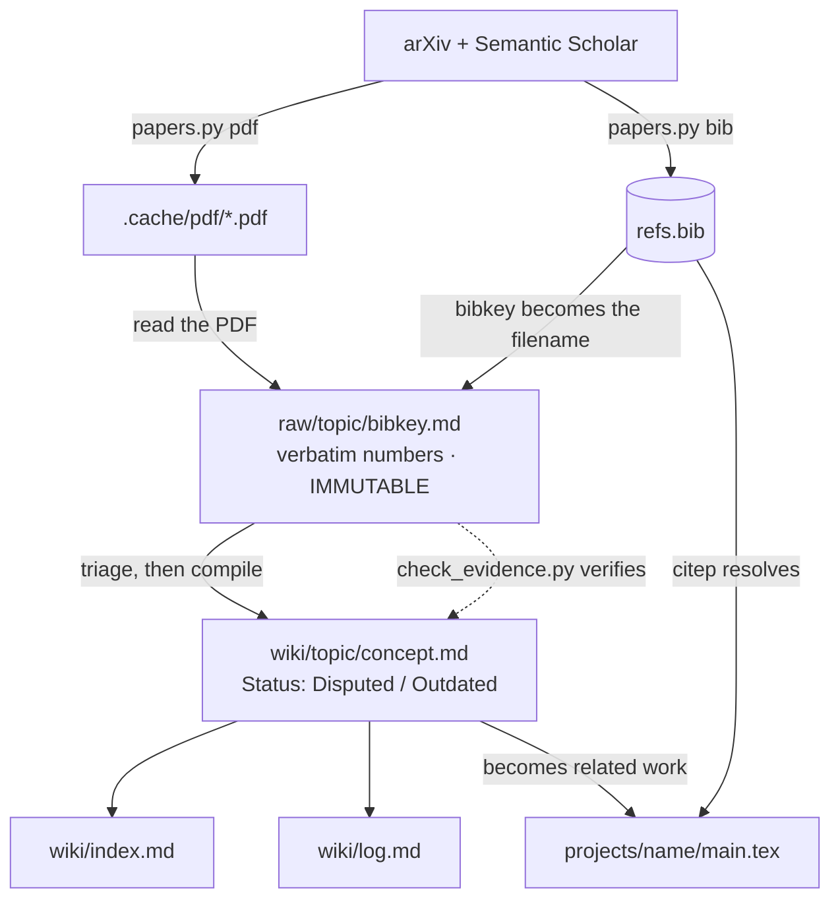

# CLAUDE.md

This file provides guidance to Claude Code (claude.ai/code) when working with code in this repository.

## What this repo is

A research workspace for ML/AI/NLP, aimed at a future CS master's: literature
review, LaTeX papers, Beamer slides, and the experiments behind them.

**There is no agent framework here to build or maintain.** Claude Code *is* the
agent; this repo is its workspace plus the config that specializes it. When a
capability is missing, the fix is a skill, a hook, a `settings.json` entry, or a
small script in `bin/` — not a new abstraction layer.

## Setup

```bash
brew install tectonic      # LaTeX engine
brew install poppler       # pdftotext + pdftoppm — without it, PDFs cannot be read
```

`poppler` is not optional: the note-writing step requires reading the paper, and
`Read` on a PDF fails without `pdftoppm`.

`bin/*.py` are stdlib-only — no venv, no `pip install`, no lockfile.

## Commands

```bash
python3 bin/papers.py search "<query>" -n 15   # arXiv + Semantic Scholar, deduped
python3 bin/papers.py bib 2005.11401           # append BibTeX to refs.bib (idempotent)
python3 bin/papers.py pdf 2005.11401           # -> .cache/pdf/<id>.pdf, then Read it
python3 bin/llm.py -m deepseek-chat "<prompt>" # cheap bulk triage (see below)

cd projects/<name> && tectonic main.tex        # build a paper or deck

# wiki fact-check: greps numbers in wiki/ against the raw/ files they link
python3 .agents/skills/karpathy-llm-wiki/scripts/check_evidence.py .

python3 bin/papers.py selftest                 # parser + bibkey assertions
python3 bin/llm.py --selftest                  # provider resolution assertions
```

There is no test framework. Each script carries a `selftest` covering its
non-trivial logic; extend that rather than adding pytest.

## Layout

```
raw/<topic>/<bibkey>.md  one source note per paper — IMMUTABLE once written
wiki/<topic>/<name>.md   cross-paper synthesis, compiled from raw/
wiki/index.md            global table of contents
wiki/log.md              append-only operation log
refs.bib                 single bibliography for every project
projects/<name>/         main.tex, slides.tex, figures/, experiments/
bin/                     stdlib-only helpers
.claude/skills/          lit-review, latex, karpathy-llm-wiki (symlink)
.agents/skills/          upstream-installed skills (npx add-skill)
.claude/hooks/           tex-check.sh
```

Topic directories in `raw/` and `wiki/` mirror each other. `wiki/` supports one
level of topic subdirectory only — no deeper nesting.

## The knowledge pipeline

Three tiers, three owners. Reading a pile of papers without the middle tier is
how a literature review stops scaling around 50 papers.

| Tier | What | Who writes it |
|---|---|---|
| PDF | `.cache/pdf/<arxiv_id>.pdf` | `papers.py pdf` |
| `raw/` | one note per paper, verbatim numbers | **lit-review** skill |
| `wiki/` | synthesis across papers, with an index | **karpathy-llm-wiki** skill |



The dotted arrow is the only mechanical check in the chain. The solid arrow into
`raw/` — PDF to note — is verified by nothing but the agent writing it.

**`raw/` is immutable.** Once a note is written it is evidence, not a draft. New
understanding goes into `wiki/`, not back into the note. This is what makes the
mechanical fact-check possible: a verified article stays verified.

**Which skill fires:** finding, fetching, reading, and noting a *single* paper →
`lit-review`. Anything spanning papers — "what do I know about X", compiling an
article, updating the index, linting → `karpathy-llm-wiki`. Its Ingest step 1
("get the source") is `papers.py` here; its Research section is superseded by
`papers.py search`, which already handles arXiv/Semantic Scholar and BibTeX.

**Bridge to LaTeX:** wiki articles cite BibTeX keys from `refs.bib`, so a mature
`wiki/<topic>/` page drops into a paper's related-work section with its citations
already resolvable. This is why note filenames are bibkeys.

## What the pipeline is actually for

Not storage. **Finding an attackable weakness in a specific existing method.**
That is the shape of a contribution at this level: locate an edge case or pain
point in a named method, then propose an optimization that addresses it. A
literature review that produces good summaries and no attackable weaknesses has
failed, however complete it looks.

So the load-bearing section of every note is `Failure modes`, not `Method` — with
each entry tagged `[stated]` (author-admitted, discount it) or `[observed]` (you
inferred it, worth more). See the `lit-review` skill for the format.

**Where leads accumulate:** a single paper's weakness is an anecdote. The same
weakness across four methods is an unsolved problem in the field, and that is a
thesis topic. Notes cannot see each other, so this only becomes visible in the
wiki — maintain `wiki/<topic>/open-problems.md`, one entry per recurring failure
mode, listing which methods exhibit it and what an attack would require.

This needs **no new tooling**: `open-problems.md` is an ordinary wiki article, so
ingest merges into it and cascade updates keep it current. When a new paper fixes
a listed problem, it gets a dated `Status: Outdated` block rather than deletion —
the fact that someone got there first is itself worth knowing, and the trail
shows how the problem was framed before it was solved.

`refs.bib` is deliberately one shared file — `.tex` files reach it as
`\bibliography{../../refs}`. Verified working from `projects/<name>/` with no
`BIBINPUTS` and no symlink; bibtex resolves the relative path itself.

## Experiments — the other half

Finding an attackable weakness is half a contribution; showing your fix works is
the other half. This protocol is adapted from `karpathy/autoresearch`.

**The evaluation harness is frozen.** Split each experiment in two: the metric
(read-only once a baseline exists) and the thing you are changing. Never edit the
metric to improve a result. If the metric is genuinely wrong, say so in the
ledger, change it deliberately, and re-baseline everything that used the old one.

This is not bureaucracy. `wiki/agents/open-problems.md` entry 3 documents three
papers whose evaluations each flatter their own method — a permissive reward, a
shifted attempt budget, annotation noise wider than the reported gap. A read-only
harness is the structural fix for the failure mode this field keeps exhibiting.

**Fix the budget so runs compare.** Pin whatever is scarce — wall-clock, tokens,
API spend, epochs — and hold it constant across the batch. A number produced under
an unpinned budget cannot be compared to anything, including its own baseline.

**Every run appends one row to `projects/<name>/experiments/results.tsv`.**
Tab-separated, because descriptions contain commas:

```
id	metric	cost	status	description
```

`status` is `keep`, `discard`, or `crash`. **The discards are the point.** A
recorded negative result is the difference between "this does not work" and
"nobody checked" — the empirical counterpart to an `[observed]` failure mode. Do
not delete a row because the idea failed.

**The first run is the baseline, unmodified.** No baseline, no claims.

**Simpler wins ties.** An improvement that arrives by *deleting* code is worth
keeping even at zero measured gain. A marginal gain that adds a pile of special
cases is not worth keeping. Report the complexity cost alongside the metric.

**Keep run output out of context.** `python3 x.py > run.log 2>&1`, then
`grep '^metric:' run.log`. Streaming a training log into the conversation buys
nothing and crowds out the reading that decides what to try next.

**Deliberately not adopted: the autonomous "NEVER STOP" loop.** It works in
autoresearch because the objective is one scalar, the harness is frozen, and a run
costs five minutes on an idle GPU. Here the objective usually is not defined yet —
choosing what to measure *is* the research. An unattended loop against an
undefined metric yields a long ledger of noise. Run experiments in batches, then
read them.

## Things that will bite you

- **Tectonic can't run `biber`**, so biblatex is unavailable. Use `natbib` +
  `bibtex`. ML venue styles are natbib-based already. See the `latex` skill.
- **The first `tectonic` run on a machine takes ~3 minutes** while it downloads
  its package bundle. It has not hung. Warm builds are ~0.7s (measured), which
  is why the build hook is viable at all.
- **A `PostToolUse` hook compiles after every `.tex` edit** and returns build
  errors to you (`.claude/hooks/tex-check.sh`). It only builds `main.tex` /
  `paper.tex` / `slides.tex` in the edited file's own directory, and no-ops if
  Tectonic isn't installed. Delete the hook entry in `.claude/settings.json` if
  it gets slow on a long paper.
- **Hooks load at session start.** Editing `.claude/settings.json` mid-session
  does not activate them — the session must be restarted. A hook that appears to
  do nothing is usually this, not a broken script; test the script directly with
  `echo '{"tool_input":{"file_path":"<abs>.tex"}}' | .claude/hooks/tex-check.sh`
  before debugging its contents.
- **arXiv BibTeX carries the last-revision year, not the venue year.** The 2017
  Transformer paper comes back as `vaswani2023attentionneed` and cites as (2023).
  Correct for a preprint, wrong for the published version — `papers.py bib`
  warns on `@misc` entries. Replace with the venue's BibTeX before submitting.
- **Semantic Scholar 429s without a key.** Unauthenticated S2 shares a global
  rate limit and fails most of the time; `papers.py search` degrades to
  arXiv-only and says so on stderr. Set `S2_API_KEY` (free) to get citation
  counts back, which is what the result ranking sorts on.
- **`bin/llm.py` is for non-Claude models only** — DeepSeek, OpenAI, and
  anything else speaking the OpenAI chat/completions format, for cheap bulk work
  like scoring 200 abstracts. Anthropic's API is not OpenAI-compatible; don't
  add Claude to `PROVIDERS`. Claude is already here.

## Non-negotiable

**Never invent a citation.** Every `\cite` key must exist in `refs.bib`, put
there by `papers.py bib`. A fabricated-but-plausible BibTeX entry is the worst
failure mode in this repo — it survives review and ends up in a submission.

**Never invent a number.** Every figure and table value traces to a script in
the relevant `experiments/`. If you can't point at what produced it, it doesn't
go in the paper.

Both apply to notes too: if you only read an abstract, `Read: abstract-only` in
the note's header says so.

**Numbers in `raw/` are verbatim.** `check_evidence.py` can grep `wiki/` against
`raw/`, but nothing can grep `raw/` against a PDF — that link in the chain is
enforced only by whoever writes the note. Round a figure there and the error is
undetectable from then on.

## Extending

- **Skill** — a repeatable multi-step procedure (`.claude/skills/<name>/SKILL.md`).
- **Hook** — something that must run automatically on every edit or session.
  One exists; add a second only when there's a real failure it catches.
- **MCP** — nothing is wired up. Paper search is a 130-line script against two
  public HTTP APIs, which needs no server. Add an MCP server when a tool needs
  auth or state that a script can't hold (Zotero, a lab notebook, a cluster).
